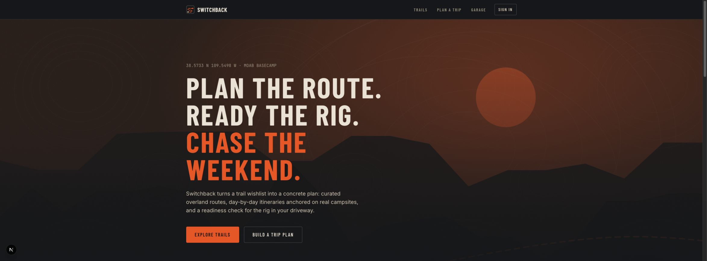
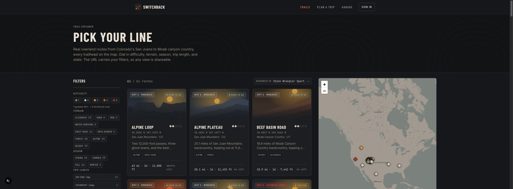
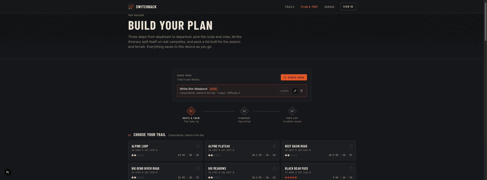

# Switchback

**Plan the route. Ready the rig. Chase the weekend.**

Switchback is an overland trip planner: browse curated off-road trails, check whether your rig can actually run them, and build a day-by-day itinerary with fuel checks and a packing loadout. Everything works locally without an account; optional sign-in syncs rigs and trips across devices.

## Features

- **Trail Explorer** (`/trails`): 61 US overland routes with difficulty, terrain, season, and mileage filters, an interactive Leaflet map, and a live go / caution / no-go readiness badge for your active rig on every card. Most routes are imported from real public data (see Trail data below); a hand-authored seed set covers the rest of the country.
- **Trail Detail** (`/trails/[slug]`): statically generated pages with a stat band, an elevation profile synced to the route map, a waypoint timeline (campsites, fuel, water, obstacles, bailouts), and a requirements panel scored against your rig.
- **Trip Builder** (`/plan`): a three-step wizard. Pick a trail and rig, split the route into drivable days with a fuel-range check, then finish with a generated pre-trip checklist and emergency field details. Save multiple trips, load them back into the builder, rename them, and remove them from the library. Each plan freezes its resolved rig specs and loadout so later Garage edits do not rewrite the trip.
- **Trip Packet** (`/plan/packet/[id]`): turn any saved trip into a mobile field brief or a print/PDF roadbook with the frozen itinerary and rig, fuel exposure, readiness checks, route waypoints, emergency contacts, packing status, source attribution, and a departure gate. Packets are planning documents and explicitly do not represent navigation-grade route data.
- **Garage** (`/garage`): create, duplicate, rename, load, and remove up to 25 named builds. Each build starts from one of three rig profiles, supports tuned specs (tires, clearance, range, lockers, winch, and more), scores every trail in a readiness matrix, and carries its own gear loadout from a 70-item catalog with a live payload bar.
- **One source of truth**: every readiness verdict and number comes from the same pure functions in `lib/derive.ts`, so the Explorer, Detail, Plan, and Garage surfaces always agree.
- **Local-first accounts**: the named-rig library, active plan, and saved-trip library live in versioned, typed `localStorage` hooks built on `useSyncExternalStore`, with legacy migration, hydration guards, and cross-tab sync. Better Auth accounts backed by MongoDB add optional cross-device sync without making sign-in a prerequisite.

## Stack

- [Next.js 16](https://nextjs.org) (App Router, Turbopack, static generation)
- [React 19](https://react.dev) + TypeScript
- [Tailwind CSS 4](https://tailwindcss.com)
- [Leaflet](https://leafletjs.com) / react-leaflet for maps
- [Better Auth](https://www.better-auth.com/) with MongoDB for optional accounts and profile sync
- Vitest + Testing Library for unit/component coverage, Playwright for browser flows
- Static, fully typed trail data under `lib/data/`
- A Node import pipeline (`scripts/import-trails/`) that builds the catalog from public GIS sources

## Running locally

```bash
npm install
cp .env.example .env.local # then fill in the values
npm run dev        # http://localhost:3000
```

The application needs MongoDB and Better Auth configuration for account routes. Use a separate local database such as `switchback_dev`; production uses `switchback`. GitHub OAuth is optional and its button stays hidden when the client ID and secret are blank.

Other scripts:

```bash
npm run build          # production build
npm run start          # serve the production build
npm run lint           # eslint
npm run typecheck      # TypeScript without emitting files
npm test               # Vitest unit and component suite
npm run test:e2e       # Playwright Chromium suite (starts the dev server)
npm run import-trails  # rebuild lib/data/trails.generated.ts from public GIS sources
```

## Trail data

Two catalogs merge at build time in `lib/data/trails.ts` (imported entries win on slug collisions):

- **Hand-authored seed** (the seed array in `lib/data/trails.ts`): 12 illustrative routes with editorial waypoints.
- **Imported catalog** (`lib/data/trails.generated.ts`): rebuilt by `npm run import-trails` from:
  - **USFS Motor Vehicle Use Map** via the [FSGeodata EDW ArcGIS services](https://data.fs.usda.gov/geodata/) (US federal data, public domain) for National Forest routes (Colorado San Juans).
  - **OpenStreetMap** via the [Overpass API](https://wiki.openstreetmap.org/wiki/Overpass_API) for BLM/NPS country (Moab). (c) OpenStreetMap contributors, licensed [ODbL 1.0](https://opendatacommons.org/licenses/odbl/); the derived trail data in this repo remains available under ODbL terms.
  - **Elevation**: USGS NED 10m sampled through [Open Topo Data](https://www.opentopodata.org/) (public domain).

The pipeline assembles route segments into named trails, samples real elevation profiles, derives stats and difficulty heuristics, and generates each trail's hero art from its own elevation profile. Editorial curation (reputation difficulty, named obstacles, campsites) lives in `scripts/import-trails/overrides.ts`. Run `node scripts/import-trails/validate.ts` to check the generated catalog against the app's derive logic.

Route alignments are simplified for trip planning. They are not for navigation.

## Deployment

Switchback is a standard Next.js App Router app that deploys to any host with a Node.js runtime and access to MongoDB.

**Vercel (recommended):**

1. Push this repo to GitHub (already wired if you cloned it from there).
2. Import the repo at [vercel.com/new](https://vercel.com/new). Vercel auto-detects Next.js; no custom build settings are needed.
3. Configure `MONGODB_URI`, `MONGODB_DB`, `BETTER_AUTH_SECRET`, and `BETTER_AUTH_URL`. Add the two GitHub OAuth variables only if that provider should be enabled.
4. Every push to `main` triggers a production deploy.

The production domain is set via `metadataBase` in `app/layout.tsx` (currently `https://switchback.jeramiahcoffey.com`). Update that value to match your own domain so Open Graph and canonical URLs resolve correctly.

The map uses keyless OpenStreetMap tiles, and all trail, rig, and gear catalog data is static. See [`.env.example`](.env.example) for the complete server-side configuration and the recommended development/production database split.

## Screenshots

### Home



### Trail Explorer



### Saved-trip library



## Project layout

```
app/            routes: /, /trails, /trails/[slug], /plan, /plan/packet/[id], /garage
components/     feature UI grouped by surface (explorer, trail-detail, plan, garage, ui)
lib/data/       trail catalogs (seed + generated), rigs, gear
lib/derive.ts   pure derived logic (readiness scoring, day splitting, fuel checks)
lib/storage.ts  typed localStorage hooks (active rig, active plan, saved trips)
lib/types.ts    domain types
lib/auth.ts     Better Auth server configuration
scripts/
  import-trails/  trail data import pipeline (MVUM + OSM -> trails.generated.ts)
```
